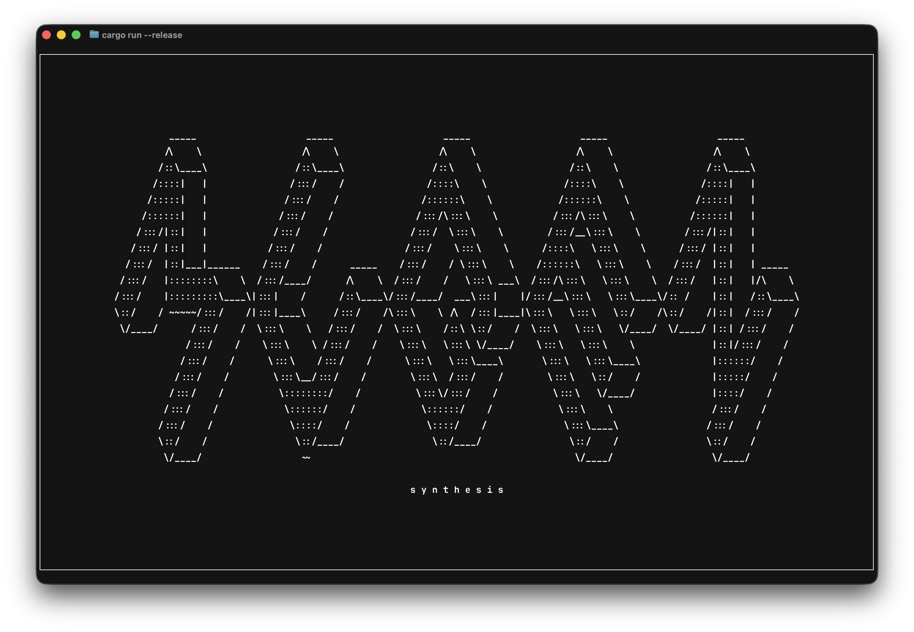

## What this is

This is a **terminal-based synthesizer** written in Rust.

You can play it live from your computer keyboard, switch waveforms on the fly, and layer notes like a real instrument. The goal is not a DAW — it’s a **playable synth** that feels immediate and hackable.

Right now it focuses on:

- real-time sound generation
- polyphonic playing
- switching sound character while notes are held

## Available waveforms

- **Sine**
- **Saw**
- **Square**
- **Triangle**
- **Noise**

You can rotate between them while playing.

## How to play

- Use the keyboard (A–L row + W/E/T/Y/U/O/P) like a small piano
- Hold multiple keys to play chords
- Press **B** to change the waveform
- Press **Q** or **Ctrl+C** to quit

## Screenshot

---

## How it thinks (very simply)

- **Generator** → produces sound (sine, saw, etc.)
- **Node** → changes sound (filters, effects, modulation)
- **PatchSource** → generator + chain of nodes
- The synth just plays the current patch for each key you press

That’s it.

---

## Next steps (planned)

### Short term

- Audio capture
- Learn **Lua** for config / scripting
- Make patches configurable
- Add lots of nodes

### Synth improvements

- One sink per voice with a **dynamic mixer** (instead of many sinks)
- Proper **envelope controls**  
  (attack, decay, sustain, release)
- Unison, detune, LFO, glide/portamento
- Mono / poly modes
- Effects (reverb, delay, distortion, flanger, phaser)
- Visualizers (waveform, volume, spectrum)

### UI

- Ratatui UI with:
    - keyboard drawn at the bottom
    - knobs/sliders for synth parameters
    - support for real keyboard + MIDI input

### Later

- Load and play WAV files
- Record output to WAV
- Record full sessions

---

## Long-term idea

A **CLI synth you can jam with friends**.

- Encrypted P2P sessions
- Everyone hears what everyone plays (like a band)
- Each player can bind sounds to keys
- Record the whole session to WAV

### Architecture idea

- Audio thread (real-time, high priority)
- Network thread (async, P2P)
- Lock-free ring buffers between them
- Low-latency streaming (<50ms target)

Session owner mixes audio and distributes it back to peers.

---

Sounds simple enough!
